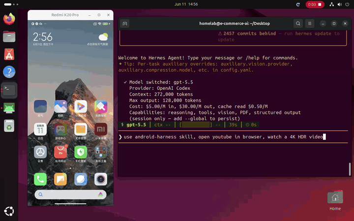

# Android Harness

中文 | [English](README.md)


**一个小而清晰的 host-side Android agent 自动化层，基于 ADB 和可选插件构建。**

Android Harness 是一个轻量、可扩展、可由 agent 边用边增强的 Android
设备控制层。它通过稳定原语操作已授权的真实设备或模拟器：ADB、截图、输入事件、
uiautomator XML、日志和文件。

它是一个独立的 Android-focused 项目，参考了 Browser Harness 的架构思想；
本项目不隶属于 Browser Use，也不代表 Browser Harness 官方 Android 版本。

当前状态：Alpha。核心 API 会尽量保持稳定，但插件、skill 约定和 CLI 仍可能演进。

## 能力概览

| 方向 | Android Harness 提供什么 |
| --- | --- |
| ADB 控制 | 默认直接通过 subprocess 调用 `adb`，也支持可选本地 daemon transport。 |
| 观察能力 | 截图、uiautomator XML、设备信息、屏幕信息、当前 app、日志和文件。 |
| 交互能力 | tap、swipe、keyevent、文本输入、等待，以及通过 CLI 执行 Python helper。 |
| Agent 工作流 | 本地 workspace helper、可复用 interaction skill、示例和手动验收文档。 |
| 扩展点 | 输入法、OCR、环境画像、policy check 等能力通过可选插件扩展。 |
| 边界 | 只面向已授权设备；不支持账号接管、验证码、支付、绕过限制或隐藏自动化信号。 |

## 演示视频

观看下面的 Android Harness skill 演示预览。

这个演示展示的是没有进行自我总结、没有沉淀可复用任务经验时的执行效果。对于重复
任务，如果把关键步骤总结成 interaction skill 或 workspace note，后续执行通常会
更快、更稳定。



## 文档入口

| 资源 | 用途 |
| --- | --- |
| [install.zh.md](install.zh.md) | CLI 和 Agent Skill 安装说明。 |
| [docs/troubleshooting.zh.md](docs/troubleshooting.zh.md) | Linux、ADB、模拟器、ADB-over-TCP 和 daemon 常见故障排查。 |
| [examples/](examples/) | 基础观察和 daemon transport 的可运行示例。 |
| [docs/helpers-reference.md](docs/helpers-reference.md) | 面向 agent 的 helper API 参考。 |
| [docs/plugin-author-guide.md](docs/plugin-author-guide.md) | 插件边界和扩展模式。 |
| [docs/manual-smoke.md](docs/manual-smoke.md) | 面向已授权设备和模拟器的手动验收。 |
| [CONTRIBUTING.md](CONTRIBUTING.md) | 贡献流程和协作预期。 |
| [ROADMAP.md](ROADMAP.md) | 当前维护方向。 |
| [CHANGELOG.md](CHANGELOG.md) | 面向用户的变更记录。 |

本地检查：

```bash
make check
```

## 核心定位

- 核心保持小而稳定，只提供 Android 自动化 primitive。
- 默认运行在开发机或 agent 所在的 host 上，通过 `adb` 控制设备。
- 它不是 Android APK，不是 AccessibilityService，也不是部署在设备里的常驻 agent。
- 任务级 helper 放在 `agent-workspace/agent_helpers.py`。
- 可复用 App 经验放在 `agent-workspace/app-skills/`。
- 可复用交互经验放在 `interaction-skills/`。
- OCR、人类化操作、环境画像、输入法适配等能力放进插件层。

## ADB 还是设备端部署？

Android Harness 的默认模式是 **ADB-first / host-side**：

```text
agent or developer machine
  -> android-harness
  -> adb
  -> authorized Android device or emulator
```

这意味着：

- 你应该在本机、CI runner、远程开发机或 agent 执行环境中安装并运行它。
- Android 设备只需要开启并授权 USB debugging，或者使用已授权的 ADB over TCP/IP。
- core 不会安装 APK，不会注入 app，不会启用 AccessibilityService。
- core 不会隐藏 ADB、root、模拟器、自动化或调试信号。
- 如果某个能力需要设备端组件，它必须作为显式插件依赖说明。例如
  `plugins/adbkeyboard_plugin.py` 依赖外部 ADBKeyboard IME。

不建议把 Android Harness 本身直接部署到 Android 设备上运行。未来如果需要
on-device agent，应作为单独项目或明确隔离的插件设计，并重新定义权限、更新、
审计和安全边界。

## 可选 ADB Daemon Transport

Android Harness 默认直接通过 subprocess 调用 `adb`。对于较长的 agent 会话，可以
显式启用本地 daemon，让 adb 命令通过 Unix socket 代理执行：

```bash
android-harness daemon start
android-harness --transport daemon doctor
android-harness daemon status
android-harness daemon stop
```

daemon 是可选能力。未设置 `--transport daemon` 或
`ANDROID_HARNESS_TRANSPORT=daemon` 时，行为仍然是默认 subprocess 路径。daemon
只监听本地 Unix socket，不隐藏 ADB、root、模拟器、自动化或调试信号。

## 快速开始

完整 CLI 和 Agent Skill 安装说明见 [install.md](install.md)，中文版见
[install.zh.md](install.zh.md)。

可运行示例见 [examples/](examples/)。

连接已经授权 USB debugging 的 Android 设备或模拟器，然后运行：

```bash
android-harness doctor
```

输出机器可读的状态快照：

```bash
android-harness snapshot
android-harness snapshot --screenshot
android-harness snapshot --page-info --output /tmp/android-snapshot.json
```

快照输出包含 `schema_version` 字段，便于 agent 和 CI 在后续 observation
格式演进时稳定解析。

通过 heredoc 执行 helper 代码：

```bash
android-harness <<'PY'
print(device_info())
print(current_app())
path = screenshot()
print(path)
PY
```

禁用本地 workspace helper：

```bash
android-harness --no-workspace <<'PY'
print(page_info())
PY
```

## Unicode 文本输入

core `type_text()` 使用 `adb shell input text`，只适合简单 ASCII 文本。中文、
emoji、符号，或 shell input 行为异常的厂商 ROM，应该通过输入法插件处理。

安装并启用 ADBKeyboard 后，可以使用可选插件：

```bash
android-harness <<'PY'
type_unicode("你好 ☂️ 17°C 湿度 100%")
clear_input()
PY
```

该插件位于 `plugins/adbkeyboard_plugin.py`。它通过 `ADB_INPUT_B64` 发送文本，
执行期间切换到 ADBKeyboard，并默认恢复之前的输入法。

## 架构

```text
src/android_harness/
  run.py       # CLI and Python execution environment
  helpers.py   # public agent-facing primitives
  adb.py       # ADB backend
  ui.py        # uiautomator XML parsing
  plugins.py   # plugin registry and boundaries
  admin.py     # diagnostics

agent-workspace/
  agent_helpers.py
  app-skills/

plugins/
  adbkeyboard_plugin.py

interaction-skills/
  permissions.md
  scrolling.md
  text-input.md
```

## 使用边界

适合的场景：

- 自有设备、测试设备、模拟器和已授权远程设备。
- App QA、自动化测试、复现 UI 问题、截图和诊断。
- agent 在授权环境中执行 Android 操作。
- 将通用 Android 操作经验沉淀为 skills。

不适合或不接受的场景：

- 未授权设备、未授权 app 或第三方账号环境。
- 账号接管、验证码处理、支付流程、批量注册、绕过风控。
- 隐藏 ADB、隐藏 root、隐藏模拟器、隐藏自动化信号。
- 把特定 App 业务流程、账号数据或私有运营逻辑加入 core。
- 把 Android Harness 描述为 Browser Harness 官方 Android 版本。

## Core、Plugin 和 Skill 分工

放进 core：

- ADB wrapper、设备事实、屏幕事实、输入事件、文件、日志、等待、诊断。
- 不依赖特定 app、账号、模型或外部服务的稳定 primitive。

放进 plugin：

- OCR、输入法适配、人类化点击、环境画像、policy guard。
- 需要额外 APK、服务、模型、网络或较重依赖的能力。

放进 `interaction-skills/`：

- 可复用的 Android 操作方法，例如权限弹窗、滚动、文本输入。
- 用 Markdown 描述的 agent 操作策略和注意事项。

放进 `agent-workspace/`：

- 当前任务需要的临时 helper。
- 特定 app 的观察记录和授权测试经验。

不要放进 core：

- app-specific business flows。
- account data。
- detection evasion。
- platform bypass logic。

## 安全披露指南

如果你发现安全问题或可能导致误用的能力边界问题，请优先使用私密渠道反馈。
如果 GitHub 仓库启用了 Security Advisory，请使用 Security Advisory；否则先创建
不包含敏感细节的 issue，说明需要私下沟通。

报告中建议包含：

- 受影响版本或 commit。
- host OS、Android 版本、设备类型和 ADB 连接方式。
- 最小复现步骤。
- 影响范围和预期边界。
- 不包含真实账号、token、支付信息、个人数据或第三方私有数据的日志。

请不要公开发布：

- 可直接用于未授权设备或账号的操作步骤。
- 绕过检测、绕过平台限制或隐藏自动化信号的细节。
- 真实设备、账号、token、短信、验证码、支付或个人数据。

## 开源协议和归属说明

本项目使用 MIT License。MIT 是一个简短、宽松的开源协议，允许商业使用、分发、
修改和私有使用，但要求保留版权声明和协议文本。

本项目参考了 Browser Harness 的架构思想，但独立实现，不隶属于 Browser Use，
也不代表 Browser Harness 官方 Android 版本。除非在 `NOTICE.md` 中明确说明，
本仓库不包含从 Browser Harness 或其他第三方项目复制的源代码、文档或资产。

如果未来引入第三方代码、文档、模型、数据集或设备端组件，必须在合并前确认其
协议兼容性，并在 `NOTICE.md` 或相应文件中保留上游版权、协议和归属说明。

更多归属和第三方说明见 `NOTICE.md`。

## License

MIT License. See `LICENSE`.
